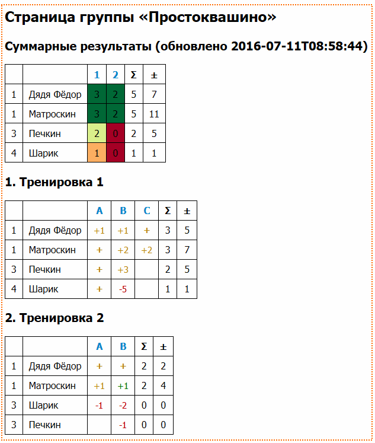

# Прогресс решения задач на информатиксе

На занятиях по программированию я даю ученикам задание решать
задачи на [информатиксе](http://informatics.mccme.ru).
Для того, что отслеживать прогресс решения были написаны эти скрипты.

Основная цель — это создание страниц со статистикой решения задач на разные
темы. В директории example есть [пример](example/progress.html) такой страницы.
Её скриншот можно увидеть ниже.



## Примечания

Данные с информатикса извлекаются путем разбора страниц (как строк), полученных с сайта.
Это значит, что все может сломаться, если разработчики информатикса поменяют формат страниц.

Примеры запуска скриптов в данном документе приведены для Виндоус и выполняются в
корневой директории проекта.

Во время написания использовалась Java 8.

## Конфигурация

Для сбора статистики необходимо указать идентификаторы учеников и идентификаторы
задач на информатиксе. Пример конфигурационного файла:

```clojure
[{:id "prostokvashino",
  :name "Простоквашино",
  :users
  [{:name "Дядя Фёдор", :mccme 1}
   {:name "Печкин", :mccme 2}],
  :contests
  [{:name "Тема 1",
    :problems
    [{:mccme 3443, :name "Степень двойки."}
     {:mccme 3444, :name "Факториал."}]}
   {:name "Тема 2",
    :problems
    [{:mccme 3501, :name "Максимум двух чисел"}]}]}
 {:id "nez",
  :name "Незнайка и его друзья",
  :accept true,
  :users
  [{:name "Незнайка", :mccme 3}
   {:name "Тюбик", :mccme 4}],
  :contests
  [{:name "Тренировка 1",
    :problems
    [{:mccme 611, :name "Простые числа"}
     {:mccme 612, :name "Выражение"}
     {:mccme 613, :name "Возрастающая подпоследовательность"}]}]}]
```

Описание структуры:

```
Конфигурация
  [первая-группа вторая-группа ...]
Группа
  {:id внутренний-идентификатор-группы
  :name имя-группы,
  :users [первый-участник второй-участник ...],
  :contests [первый-набор-задач второй-набор-задач ...]}
Участник
  {:name имя-участника :mccme идентификатор-на-информатиксе}
Набор задач
  {:name имя-набора
  :problems [первая-задача вторая-задача ...]}
Задача
  {:name название-задачи :mccme идентификатор-на-информатиксе}
```

У группы есть необязательный параметр :accept (см. пример группы
с Незнайкой). Он необходим, чтобы различать решения, которые прошли
все тесты и имеют статус «OK» от решений, которые были просмотрены
учителем и имеют статус «Принято». Если параметр указан, то такие решения
отличаются визуально на итоговой странице.

Для удобства изменения конфигурации написан скрипт update-config.clj,
который позволяет в конфигурационном файле вместо полного описания задачи
указывать только идентификатор.

```clojure
[
{
  :id "prostokvashino",
  :name "Простоквашино", 
  :users
  [
    {:name "Дядя Фёдор", :mccme 1}
    {:name "Печкин", :mccme 2}
  ],
  :contests
  [
    {:name "Тема 1", :problems [3443 3444]}
    {:name "Тема 2", :problems [3501]}
  ]
}
{
  :id "nez",
  :name "Незнайка и его друзья",
  :accept true,
  :users
  [
    {:name "Незнайка", :mccme 3}
    {:name "Тюбик", :mccme 4}
  ],
  :contests
  [
    {:name "Тренировка 1",:problems [611 {:mccme 612, :name "Выражение"} 613]}
  ]
}
]
```

Запуск update-config создает новый файл с дополнительным расширением new в
котором идентификаторы задач заменены на словарь из идентификатора и имени. 

Пример запуска, который приводит к появлению файла example\preconfig.clj.new:

```
java -cp "src;target\lib\*" clojure.main update-config.clj example\preconfig.clj
```

## Получение результатов

Для того, чтобы получить страницы с прогрессом необходимо запустить скрипт group-progress.local,
указав ему три параметра: файл с настройками, вспомогательный файл для кеширования, директория в
которой будут созданы страницы.

```
java -cp "src;target\lib\*" clojure.main -m group-progress.local config-file cache-file output-dir
```

Имена файлов со страницами будут совпадать с внутренними идентификаторами групп. Для
конфигурации из примера файлы будут названы prostokvashino.html и nez.html.

Что такое файл для кеширования? Для получения результатов скрипт выполняет два GET запроса для
каждого пользователя. Первый позволяет узнать сколько всего посылок у ученика на информатиксе.
Во втором указывается количество последних посылок, информацию о которых мы хотим получить. По
умолчанию скачиваются все. Но делать так каждый раз может быть избыточно, поэтому в файле
для кеширования запоминаются уже известные посылки и в следующий раз запрашивается информация
только о новых. При вызове скрита можно указать несуществующий файл, тогда скрипт скачает все
посылки, создаст файл с указанным именем и сохранит посылки в этот файл. Этот файл можно
периодически удалять вручную. Например, когда посылки, прошедшие все тесты и получившие «OK»
просматриваются учителем и меняют свой статус.

